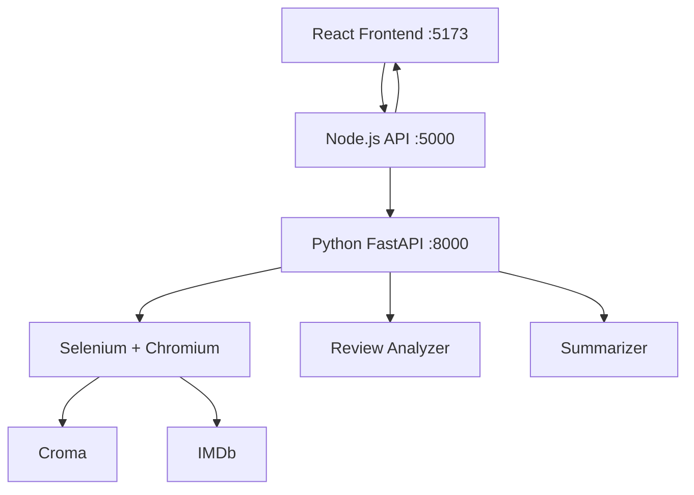

# 🕷️ Review Intelligence

> **Scrape. Analyze. Understand.**

A full-stack web scraping and review intelligence platform that collects, analyzes, and visualizes product/movie reviews from **Croma** and **IMDb**.

Built as a modern three-tier architecture: **React** dashboard → **Node.js/Express** API gateway → **Python/FastAPI** scraping and analysis service.

---

## ✨ Features

| Feature | Description |
|---------|-------------|
| **Multi-Platform Scraping** | Scrape reviews from Croma (electronics) and IMDb (movies) |
| **Async Job Processing** | Non-blocking scraping with real-time status polling |
| **Review Analytics** | Total reviews, average rating, rating distribution |
| **Sentiment Analysis** | Rating-based positive/neutral/negative breakdown |
| **Extractive Summarization** | Lightweight 3–5 sentence summary (no LLM required) |
| **Character-Wise Storage** | Every review stored as `list(review)` preserving all characters |
| **Interactive Dashboard** | Search, filter by rating, sort, paginate reviews |
| **Character Viewer** | Inspect character-by-character representation per review |
| **CSV Download** | Export scraped data with all fields including character arrays |
| **Docker Support** | Full `docker compose up` deployment with Chromium |

---

## 🏗️ Architecture

```
Browser
  ↓
React (Vite) — port 5173
  ↓ HTTP REST
Node.js / Express — port 5000
  ↓ HTTP POST
FastAPI (Python) — port 8000
  ↓ Selenium
Chromium → Croma / IMDb
  ↓
Reviews → Analytics + Summary → Dashboard
```



---

## 🛠️ Tech Stack

| Layer | Technology | Purpose |
|-------|-----------|---------|
| Frontend | React 18, Vite, Recharts | Interactive SaaS-style dashboard |
| API Gateway | Node.js, Express.js | Job management, validation, proxying |
| Scraping Service | Python, FastAPI, Selenium, BeautifulSoup | Web scraping and HTML parsing |
| Analytics | Pandas | Rating analysis, sentiment computation |
| Summarization | Custom extractive (TF-based) | Lightweight review summarization |
| Containerization | Docker, Docker Compose | Full-stack deployment |

---

## 📁 Project Structure

```
web_scraping_project/
├── frontend/                    # React Vite application
│   ├── src/
│   │   ├── components/
│   │   │   ├── Header.jsx
│   │   │   ├── ScraperForm.jsx
│   │   │   ├── StatsCards.jsx
│   │   │   ├── RatingChart.jsx
│   │   │   ├── SummaryCard.jsx
│   │   │   ├── ReviewTable.jsx
│   │   │   ├── CharacterViewer.jsx
│   │   │   └── LoadingState.jsx
│   │   ├── services/
│   │   │   └── api.js
│   │   ├── styles/
│   │   │   └── main.css
│   │   ├── App.jsx
│   │   └── main.jsx
│   ├── package.json
│   └── vite.config.js
│
├── server/                      # Node.js Express API
│   ├── src/
│   │   ├── routes/
│   │   │   ├── scrapeRoutes.js
│   │   │   └── healthRoutes.js
│   │   ├── controllers/
│   │   │   └── scrapeController.js
│   │   ├── services/
│   │   │   └── pythonService.js
│   │   ├── middleware/
│   │   │   └── errorHandler.js
│   │   └── server.js
│   └── package.json
│
├── python-service/              # Python FastAPI service
│   ├── scraper/
│   │   ├── common.py            # Shared browser configuration
│   │   ├── croma_scraper.py     # Croma review scraper
│   │   └── imdb_scraper.py      # IMDb review scraper
│   ├── analysis/
│   │   ├── review_analyzer.py   # Rating analytics & sentiment
│   │   └── summarizer.py        # Extractive text summarizer
│   ├── tests/
│   │   ├── test_common.py
│   │   ├── test_review_analyzer.py
│   │   └── test_summarizer.py
│   ├── app.py                   # FastAPI entry point
│   └── requirements.txt
│
├── notebooks/                   # Original Jupyter notebooks
│   ├── project_web_scrape.ipynb
│   └── imdb_web_scraping.ipynb
│
├── docker-compose.yml
├── .env.example
├── .gitignore
└── README.md
```

---

## 🚀 Getting Started

### Prerequisites

- **Node.js** 18+ 
- **Python** 3.10+
- **Google Chrome** or **Chromium** (for Selenium)
- **Docker** (optional, for containerized deployment)

### 1. Clone the Repository

```bash
git clone https://github.com/Ravana01m/web_scraping_project.git
cd web_scraping_project
```

### 2. Set Up Environment Variables

```bash
cp .env.example .env
```

### 3. Start the Python Service

```bash
cd python-service
pip install -r requirements.txt
uvicorn app:app --reload --port 8000
```

### 4. Start the Node.js Backend

```bash
cd server
npm install
npm run dev
```

### 5. Start the React Frontend

```bash
cd frontend
npm install
npm run dev
```

### 6. Open the Application

Navigate to **http://localhost:5173**

---

## 🐳 Docker Deployment

```bash
docker compose up --build
```

This starts all three services:
- **Frontend**: http://localhost:5173
- **Node API**: http://localhost:5000
- **Python Service**: http://localhost:8000

---

## 🌐 Cloud Deployment (Vercel + Render)

### 1. Deploy Frontend to Vercel
1. Import `https://github.com/Ravana01m/web_scraping_project` into [Vercel](https://vercel.com).
2. Vercel automatically detects `vercel.json` and builds the React Vite frontend.
3. Set Environment Variable in Vercel settings:
   - `VITE_API_URL`: Your backend API URL (e.g., `https://node-review-api.onrender.com`)

### 2. Deploy Backend to Render (Docker + Chromium)
Selenium requires Chromium, which is containerized in `python-service/Dockerfile`.
1. Go to [Render](https://render.com) and click **New +** → **Blueprint**.
2. Select `render.yaml` from this repository. Render automatically provisions:
   - **Python Scraping Service** (Docker image with Chromium/ChromeDriver)
   - **Node.js API Gateway** (Express backend connected to Python service)
3. Set `FRONTEND_URL` in Render to your Vercel URL (e.g., `https://web-scraping-project.vercel.app`).

---

## 📡 API Documentation

### Node.js API (port 5000)

| Method | Endpoint | Description |
|--------|----------|-------------|
| `GET` | `/api/health` | Health check |
| `POST` | `/api/scrape` | Start a scraping job |
| `GET` | `/api/scrape/:jobId` | Get job status / results |
| `GET` | `/api/scrape/:jobId/download` | Download CSV |

#### POST /api/scrape

```json
{
  "platform": "croma",
  "url": "https://www.croma.com/apple-iphone-13-128gb/p/243460",
  "maxReviews": 100
}
```

**Response (202 Accepted):**
```json
{
  "jobId": "abc-123",
  "status": "queued"
}
```

#### GET /api/scrape/:jobId

**Response (completed):**
```json
{
  "jobId": "abc-123",
  "status": "completed",
  "data": {
    "totalReviews": 85,
    "averageRating": 4.32,
    "ratingDistribution": { "1": 3, "2": 5, "3": 10, "4": 27, "5": 40 },
    "sentiment": { "positive": 78.82, "neutral": 11.76, "negative": 9.41 },
    "summary": "Most reviewers praise the camera quality and display...",
    "reviews": [
      {
        "rating": "5",
        "review": "This phone has an excellent camera.",
        "review_characters": ["T","h","i","s"," ","p","h","o","n","e",...],
        "likes": null,
        "dislikes": null
      }
    ]
  }
}
```

### Python FastAPI (port 8000)

| Method | Endpoint | Description |
|--------|----------|-------------|
| `GET` | `/health` | Health check |
| `POST` | `/scrape` | Scrape and analyze reviews |

---

## 🧪 Testing

### Python Tests

```bash
cd python-service
python -m pytest tests/ -v
```

**Test coverage:**
- Character conversion (spaces, punctuation, emojis, capitalization, special chars)
- Review normalization
- Average rating calculation (valid, empty, mixed)
- Rating distribution
- Sentiment analysis
- Summary generation (empty, single, multiple reviews)

---

## 📊 Review Data Model

Each review includes character-wise representation:

```json
{
  "rating": "5",
  "review": "This phone is excellent!",
  "review_characters": ["T","h","i","s"," ","p","h","o","n","e"," ","i","s"," ","e","x","c","e","l","l","e","n","t","!"],
  "likes": "20",
  "dislikes": "2"
}
```

**Important**: Characters are stored as `list(review)`, NOT `review.split()`. This preserves:
- ✅ Spaces
- ✅ Punctuation
- ✅ Emojis
- ✅ Numbers
- ✅ Special characters
- ✅ Capitalization
- ✅ Character order

---

## ⚡ Performance Optimizations

Improvements over the original notebook implementation:

| Optimization | Before | After |
|-------------|--------|-------|
| Image loading | Enabled | Disabled via Chrome prefs |
| Page load strategy | `normal` | `eager` |
| Wait strategy | `time.sleep(2)` | Explicit `WebDriverWait` |
| HTML parsing | Element-by-element Selenium (IMDb) | Bulk BeautifulSoup parse |
| Review limit | Scrape all reviews | Stop at `max_reviews` |
| Browser cleanup | Sometimes missed | Always in `try/finally` |
| Browser config | Duplicated per scraper | Shared `common.py` |
| Anti-detection | Partial | Full (user-agent, excludeSwitches, blink features) |

---

## ⚠️ Limitations

- **Website HTML can change**: Croma and IMDb may update their DOM structure, breaking CSS selectors. The selectors would need updating.
- **Rate limiting**: Automated traffic may be rate-limited or blocked by target websites.
- **Cloud deployment**: Requires Chromium/ChromeDriver dependencies. Not all cloud platforms support headless browsers.
- **In-memory job store**: Jobs are lost when the Node.js server restarts. For persistence, add SQLite or PostgreSQL.
- **Scraping accuracy**: The number of reviews actually scraped may be less than requested if fewer reviews exist or load-more buttons stop working.
- **No real progress tracking**: The frontend shows status phases (queued/scraping/analyzing) but cannot track exact percentage since we don't know total reviews upfront.

---

## 📜 License

This project is for educational and portfolio demonstration purposes.

---

## 🙏 Acknowledgments

Built upon the original web scraping notebooks with Selenium and BeautifulSoup. Upgraded to a full-stack application suitable for demonstrating skills in:
- **Frontend**: React, component architecture, state management
- **Backend**: Node.js API design, async job processing
- **Python**: Web scraping, data analysis, NLP
- **DevOps**: Docker, multi-service orchestration
- **Data Engineering**: ETL pipeline, structured data modeling
